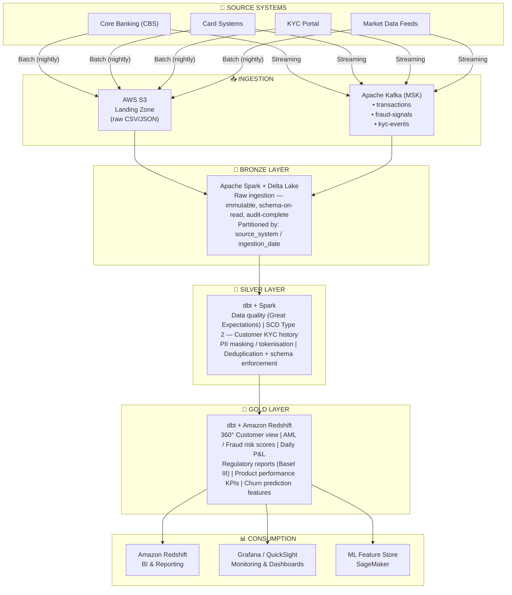

# Banking Data Engineering Platform

> **Production-grade** end-to-end data engineering platform for banking — processing KYC, transactions, fraud signals, and regulatory reports across a full modern data stack.


---



---

## 🛠️ Tech Stack

| Layer | Tool | Purpose |
|-------|------|---------|
| **Ingestion (batch)** | Apache Spark 3.5 + Delta Lake | Idempotent raw ingestion |
| **Ingestion (streaming)** | Apache Kafka (AWS MSK) + Avro | Real-time transaction stream |
| **Transformation** | dbt Core 1.7 | SQL transformations, lineage, docs |
| **Orchestration** | Apache Airflow 2.8 | DAG scheduling, SLAs, backfill |
| **Storage** | AWS S3 + Delta Lake | Data lake with ACID transactions |
| **Serving** | Amazon Redshift Serverless | Analytics & regulatory reporting |
| **Data Quality** | Great Expectations | Schema + content validation |
| **Infrastructure** | Terraform | IaC for all AWS resources |
| **Monitoring** | Grafana + CloudWatch | Pipeline health & data SLAs |
| **CI/CD** | GitHub Actions | Test, lint, deploy on every push |
| **Schema Registry** | Confluent Schema Registry | Avro schema evolution for Kafka |
| **Secrets** | AWS Secrets Manager | Credential rotation |

---

## 📁 Project Structure

```
banking-data-platform/
├── .github/workflows/          # CI/CD pipelines
│   ├── ci.yml                  # Lint, test, security scan
│   ├── dbt.yml                 # dbt run + test on PR
│   └── terraform.yml           # Infra deployment
│
├── airflow/dags/               # Orchestration
│   ├── banking_daily_pipeline.py
│   ├── streaming_consumer_dag.py
│   └── utils/
│
├── dbt/                        # SQL transformations
│   ├── models/
│   │   ├── bronze/             # Source staging
│   │   ├── silver/             # Cleansed + enriched
│   │   └── gold/               # Business-ready
│   ├── tests/                  # Custom dbt tests
│   ├── macros/                 # Reusable Jinja macros
│   └── snapshots/              # SCD Type 2 (dbt snapshots)
│
├── kafka/
│   ├── producers/              # CBS → Kafka producers
│   ├── consumers/              # Kafka → Delta Lake consumers
│   └── schemas/                # Avro schemas
│
├── spark/
│   ├── bronze/                 # Raw ingestion jobs
│   ├── silver/                 # Data quality + cleansing
│   ├── gold/                   # Aggregations
│   └── utils/                  # Shared Spark utilities
│
├── terraform/                  # AWS infrastructure as code
│   ├── modules/
│   │   ├── s3/                 # Data lake buckets
│   │   ├── kafka/              # MSK cluster
│   │   ├── redshift/           # Serving layer
│   │   ├── iam/                # Roles & policies
│   │   └── monitoring/         # CloudWatch + Grafana
│   └── environments/           # dev / prod configs
│
├── great_expectations/         # Data quality suites
├── grafana/dashboards/         # Monitoring dashboards
├── data/                       # Sample & seed data
├── tests/                      # Unit + integration tests
└── docs/                       # Architecture & runbooks
```

---

## 🚀 Quick Start

### Prerequisites
- Python 3.11+, Java 11 (for Spark), Docker, Terraform 1.7+, AWS CLI

### 1. Install dependencies
```bash
git clone https://github.com/yassine-fetoui/banking-data-engineering.git
cd banking-data-engineering
make install
```

### 2. Start local stack (Kafka + Spark + Airflow)
```bash
make docker-up
# Airflow UI → http://localhost:8080  (admin/admin)
# Kafka UI   → http://localhost:8090
```

### 3. Run Spark pipeline locally
```bash
make run-bronze ENV=local
make run-silver ENV=local
make run-gold   ENV=local
```

### 4. Run dbt transformations
```bash
cd dbt && dbt deps && dbt run && dbt test
```

### 5. Deploy infrastructure (AWS)
```bash
make terraform-init ENV=dev
make terraform-apply ENV=dev
```

---

## 🧠 Key Engineering Concepts

### SCD Type 2 — KYC Customer History
Customer KYC status changes are tracked with full history using dbt snapshots and Spark MERGE. Every state change produces a new record with `valid_from` / `valid_to` / `is_current` columns, preserving a complete audit trail for regulators.

### Exactly-Once Kafka Semantics
Transaction producers use idempotent Kafka producers with `enable.idempotence=true`. Consumers write to Delta Lake using transaction IDs as idempotency keys, preventing double-counting in fraud and P&L calculations.

### Delta Lake MERGE (Upserts)
All Silver and Gold layers use Delta Lake `MERGE INTO` for idempotent, ACID-compliant upserts — safe to re-run on failure without corrupting downstream tables.

### AML / Fraud Risk Scoring
The Gold layer computes behavioural risk features: transaction velocity, geographic anomalies, dormant account reactivation, and round-amount patterns. These feed both rule-based alerts and an ML scoring model.

### Regulatory Reporting (Basel III)
Gold layer includes pre-built views for capital adequacy ratios, liquidity coverage ratio (LCR), and large exposure reporting — queryable directly from Redshift.

---

## 📊 dbt Model Lineage

```
source(core_banking) ──→ stg_customers ──→ dim_customers (SCD2)
                                        └──→ fct_transactions ──→ aml_risk_scores
source(card_systems)  ──→ stg_cards    ──→ fct_card_transactions ──→ fraud_features
source(market_data)   ──→ stg_fx_rates ──→ fct_pnl_daily ──→ rpt_balance_sheet
```

---

## 🔒 Security & Compliance

- **PII masking**: customer names, NIN, card numbers tokenised at Bronze ingestion
- **Column-level encryption**: Redshift column-level access control per business role
- **Audit trail**: every Delta Lake table has `_ingested_at`, `_source_system`, `_batch_id`
- **Secrets rotation**: AWS Secrets Manager with 90-day automatic rotation
- **Data lineage**: dbt docs expose full column-level lineage

---

## 👤 Author

**Yassine Fetoui** — Senior Data Engineer  
[GitHub](https://github.com/yassine-fetoui) · [LinkedIn](https://linkedin.com/in/yassine-fetoui)
