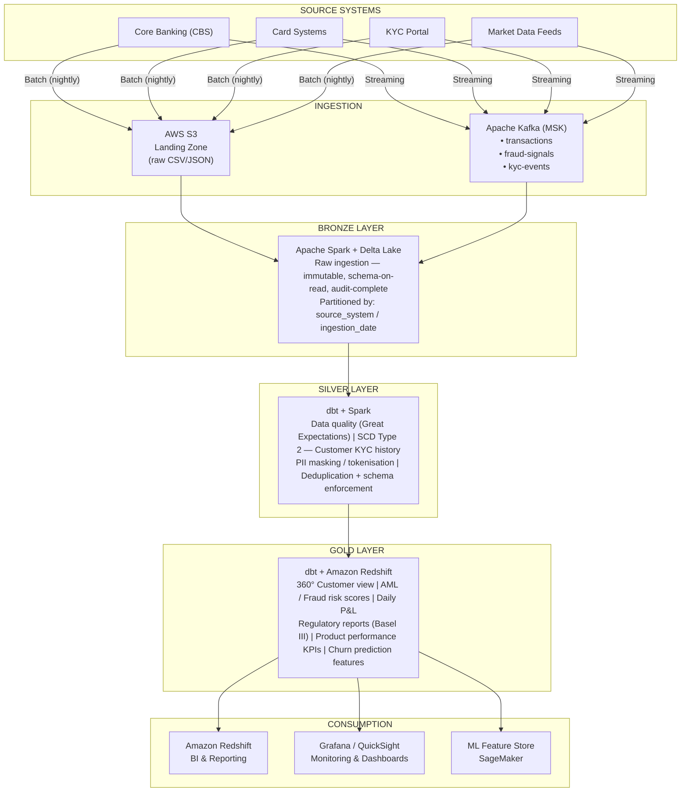

# Banking Data Engineering Platform

> **A production-grade, end-to-end data engineering platform designed for the banking sector.** It processes KYC (Know Your Customer) data, transactions, fraud signals, and regulatory reports, leveraging a modern, robust data architecture.

---


##  Detailed Architecture

This platform's architecture is designed to ensure the **reliability**, **scalability**, **security**, and **regulatory compliance** of banking data. It is structured into several distinct layers, each with clear responsibilities, ensuring a consistent, auditable data flow from source to consumption.



---

### 1. Ingestion Layer

This layer is responsible for **collecting raw data** from various banking sources. It is optimized to handle both **batch data streams** and **real-time streaming data**, ensuring high availability and low latency for critical data.

*   **Data Sources**: Systems include **Core Banking Systems (CBS)** for transactional data and customer accounts, **Card Systems** for credit/debit card activities, **KYC Portals** for customer identification information, and **Market Data Feeds** for stock quotes, exchange rates, and other external financial data.

*   **Ingestion Mechanisms**:
    *   **Batch (Nightly/Scheduled)**: For large volumes of less time-sensitive data, such as end-of-day reports or historical KYC updates. Ingestion occurs via Spark/Delta Lake connectors to **AWS S3 (Landing Zone)**.
    *   **Streaming (Real-time/Near Real-time)**: For data requiring immediate processing, such as financial transactions, fraud signals, and KYC events. **Apache Kafka (AWS MSK)** is used as an event bus, with **Avro** for message serialization and **Confluent Schema Registry** for schema management, ensuring data compatibility over time.

*   **Landing Zone (AWS S3)**: Serves as the initial repository for raw batch-ingested data. Data is stored in its original format (CSV, JSON, Parquet) in an **immutable** manner, with **S3 versioning** enabled for audit and recovery purposes. Partitioning by `source_system` and `ingestion_date` optimizes access and data lifecycle management.

*   **Event Bus (Apache Kafka - AWS MSK)**: Provides a distributed and resilient messaging platform for real-time data streams. Dedicated topics are configured for transactions, fraud signals, and KYC events, with **exactly-once semantics** to guarantee the integrity of critical data.

### 2. Bronze Layer

The Bronze layer is the first step in data persistence after ingestion. Its primary objective is to store raw data in an **immutable and auditable** manner, without any transformations. It acts as a single source of truth for all downstream layers.

*   **Technology**: This layer is built on **Apache Spark** for distributed processing and **Delta Lake** for storage. Delta Lake offers ACID (Atomicity, Consistency, Isolation, Durability) capabilities and version management, essential for auditability and reliability.

*   **Key Features**:
    *   **Immutability**: Data is stored as-is, preserving the original state for audit and replay needs.
    *   **Schema-on-Read**: Provides flexibility to adapt to evolving source schemas without breaking upstream pipelines.
    *   **Full Auditability**: Each record includes ingestion metadata (`_ingested_at`, `_source_system`, `_batch_id`) for complete traceability.
    *   **Strategic Partitioning**: Data is partitioned by `source_system` and `ingestion_date` to optimize query performance and data lifecycle management.
    *   **Robust Error Handling**: Utilizes fault-tolerant ingestion modes (e.g., Spark's `permissive` mode) and quarantine tables to isolate and manage malformed records.
    *   **File Optimization**: Delta Lake `OPTIMIZE` is used to compact small files, thereby improving read performance and reducing storage costs.

### 3. Silver Layer

The Silver layer is the core of **data cleaning, enrichment, and transformation**. It takes raw data from the Bronze layer and applies quality, cleansing, and compliance rules to create a consistent and reliable dataset.

*   **Technology**: Primarily **dbt (Data Build Tool)** for declarative SQL transformations and lineage management, complemented by **Apache Spark** for more complex transformations or large-scale processing.

*   **Key Features**:
    *   **Data Quality**: Deep integration of **Great Expectations** for validating schemas, data types, and business constraints. Automated alerts are configured to flag any non-compliance, ensuring the reliability of downstream data.
    *   **Change Data Capture (SCD Type 2)**: Implementation of **Slowly Changing Dimensions Type 2** to track the full history of key attributes (e.g., customer KYC history). This is achieved via `dbt snapshots` and Delta Lake `MERGE` operations, providing a complete audit trail.
    *   **PII Masking and Tokenization**: Rigorous application of masking, hashing, or tokenization techniques for **Personally Identifiable Information (PII)**. This step is crucial for compliance with regulations such as GDPR and CCPA, reducing the exposure of sensitive data.
    *   **Deduplication and Schema Enforcement**: Elimination of duplicate records and strict enforcement of schemas to ensure data uniformity and consistency.
    *   **Data Enrichment**: Joins with internal reference data or external sources to add context and value (e.g., country codes, transaction categories, external credit scores).
    *   **Robust dbt Tests**: Implementation of unit and integration tests via dbt to validate transformation logic and data quality at each stage.

### 4. Gold Layer

The Gold layer represents the **aggregated and business-ready view** of the data. It is optimized for analytics, regulatory reporting, and machine learning applications, offering high performance for complex queries.

*   **Technology**: **dbt** for modeling and final transformations, with **Amazon Redshift** as the analytical data warehouse for serving.

*   **Key Features**:
    *   **360° Business Views**: Creation of consolidated and aggregated views, such as the **360° customer view** or **product view**, offering a holistic understanding of business entities for analysts and decision-makers.
    *   **AML/Fraud Risk Scoring**: Calculation of sophisticated **behavioral risk features**, such as transaction velocity, geographical anomalies, dormant account reactivation, and round-amount patterns. These scores feed both **rule-based alerts** and a **machine learning scoring model**, enhancing the detection of suspicious activities.
    *   **Regulatory Reporting**: Generation of reports compliant with international banking standards (e.g., **Basel III**, IFRS 9) via materialized views or aggregated tables in Redshift, simplifying compliance and audits.
    *   **Financial KPIs and Metrics**: Precise calculation of **Key Performance Indicators (KPIs)** and financial metrics (e.g., daily P&L, balance sheet, liquidity ratios) for performance monitoring and strategic decision-making.
    *   **ML Feature Store**: Export of aggregated and transformed features to a **Feature Store** (e.g., Amazon SageMaker Feature Store) for training and inference of machine learning models, ensuring feature consistency between training and production.
    *   **Redshift Query Optimization**: Design of tables and views optimized for Redshift performance, including the use of appropriate distribution keys and sort keys to accelerate analytical queries.

### 5. Serving Layer

This layer is the final access point for data consumers, whether they are business analysts, reporting systems, or machine learning applications.

*   **Amazon Redshift Serverless**: A serverless analytical data warehouse solution, offering high scalability and performance for ad-hoc queries, BI, and reporting.
*   **Visualization Tools**: Seamless integration with tools like **Grafana** and **Amazon QuickSight** for creating interactive dashboards, monitoring business metrics, and visualizing data.
*   **ML Feature Store (Amazon SageMaker)**: Allows serving prepared features to machine learning models, facilitating the deployment and management of models in production.

### 6. Orchestration & Automation

Orchestration is essential for managing the complexity of data pipelines, ensuring their reliable execution, and automating end-to-end processes.

*   **Apache Airflow**: Used for orchestrating **DAGs (Directed Acyclic Graphs)**, scheduling jobs, managing dependencies, backfilling historical data, and enforcing **SLAs (Service Level Agreements)**.
    *   **Custom Operators**: Development of specific Airflow operators to effectively interact with AWS services (S3, MSK, Redshift, SageMaker) and tools (Spark, dbt).
    *   **Error Handling and Alerts**: Integration with **AWS CloudWatch** and **Amazon SNS** for proactive notification of job failures and workflow monitoring.

### 7. Data Quality & Governance

Data quality and governance are fundamental pillars of this platform, ensuring the reliability, compliance, and traceability of data assets.

*   **Great Expectations**: For continuous data validation at each stage of the pipeline (Bronze, Silver, Gold), ensuring that data meets defined expectations.
*   **dbt Docs**: Automatic generation of comprehensive data model documentation, including data **lineage** and test results, facilitating understanding and maintenance.
*   **AWS Glue Data Catalog**: Serves as a centralized data catalog for data discovery, metadata management, and integration with other AWS services.
*   **Retention Policies**: Strict definition and enforcement of data retention policies for each layer, in compliance with regulatory requirements and internal policies.

### 8. Infrastructure as Code (IaC) & CI/CD

The **Infrastructure as Code (IaC)** approach and Continuous Integration/Continuous Deployment (CI/CD) are adopted to automate the deployment, management, and maintenance of infrastructure and applications, ensuring reproducibility and speed.

*   **Terraform**: Used for declarative management of AWS infrastructure (S3, MSK, Redshift, IAM, Monitoring). This allows defining infrastructure as code, facilitating versioning, review, and automated deployment.
    *   **Reusable Modules**: Creation of Terraform modules for common infrastructure components, promoting reuse and standardization.
    *   **Environment Management**: Separation of configurations by environment (dev, staging, prod) for secure and isolated management.
*   **GitHub Actions**: For automated CI/CD pipelines, enabling fast and reliable integration and deployment.
    *   **Automated Tests**: Integration of linting, unit tests, dbt tests, and security scans into the CI/CD pipeline.
    *   **Continuous Deployment**: Automated deployment of infrastructure (via Terraform) and applications (Spark jobs, dbt models, Airflow DAGs) with each validated change.

### 9. Security & Compliance

Security and compliance are paramount in the banking sector. This platform integrates robust security measures at every level.

*   **PII Masking and Tokenization**: As detailed in the Silver layer, PII is protected from ingestion.
*   **Column-Level Encryption**: Utilization of Redshift capabilities for granular column-level access control, based on business roles, ensuring that only authorized users can access sensitive data.
*   **Audit Trail**: Ingestion metadata in Delta Lake, S3 access logs, and **AWS CloudTrail** for AWS activities provide a comprehensive audit trail for compliance.
*   **Secrets Rotation**: **AWS Secrets Manager** is used for secure management and automatic rotation of credentials and API keys, reducing compromise risks.
*   **Access Management (IAM)**: Granular **AWS IAM** policies are applied for the principle of least privilege, limiting access to necessary resources.
*   **Network Isolation**: Use of **VPC (Virtual Private Cloud)** and **Security Groups** to isolate infrastructure and control network traffic.

### 10. Monitoring & Alerting

A comprehensive monitoring and alerting system is in place to ensure the operational health, performance, and data quality of the pipeline.

*   **Grafana + CloudWatch**: Custom dashboards are created in Grafana, powered by **AWS CloudWatch** metrics, to monitor infrastructure (CPU, memory, disk), Kafka performance, Spark job execution, and Airflow DAGs.
*   **Proactive Alerts**: Configuration of alerts via CloudWatch and **Amazon SNS** for job failures, exceeded data quality thresholds, performance anomalies, or security issues.
*   **Centralized Logging**: Use of **CloudWatch Logs** for centralized collection and analysis of logs from all platform components, facilitating debugging and incident analysis.

---

##  Tech Stack

| Layer / Category | Tool / Service | Key Objective |
|--------------------|-----------------|--------------|
| **Ingestion (Batch)** | Apache Spark 3.5 + Delta Lake | Idempotent Raw Ingestion |
| **Ingestion (Streaming)** | Apache Kafka (AWS MSK) + Avro | Real-time Transaction Stream |
| **Transformation** | dbt Core 1.7 | SQL Transformations, Lineage, Docs |
| **Orchestration** | Apache Airflow 2.8 | DAG Scheduling, SLAs, Backfill |
| **Storage** | AWS S3 + Delta Lake | Data Lake with ACID Transactions |
| **Serving** | Amazon Redshift Serverless | Analytics & Regulatory Reporting |
| **Data Quality** | Great Expectations | Schema + Content Validation |
| **Infrastructure** | Terraform | Infrastructure as Code (IaC) for AWS |
| **Monitoring** | Grafana + CloudWatch | Pipeline Health & Data SLAs |
| **CI/CD** | GitHub Actions | Test, Lint, Deploy on Every Push |
| **Schema Registry** | Confluent Schema Registry | Avro Schema Evolution for Kafka |
| **Secrets Management** | AWS Secrets Manager | Secure Credential Rotation |

---

##  Project Structure

The project structure is organized modularly to facilitate development, maintenance, and scalability.

```
banking-data-platform/
├── .github/workflows/          # CI/CD pipelines (lint, test, security, dbt, terraform)
├── airflow/dags/               # Airflow DAGs for pipeline orchestration
│   ├── banking_daily_pipeline.py
│   ├── streaming_consumer_dag.py
│   └── utils/                  # Shared utilities for Airflow
├── dbt/                        # dbt models for SQL transformations
│   ├── models/                 # Bronze, Silver, Gold models
│   │   ├── bronze/             # Raw source staging
│   │   ├── silver/             # Cleaned and enriched data
│   │   └── gold/               # Business-ready data
│   ├── tests/                  # Custom dbt tests
│   ├── macros/                 # Reusable Jinja macros
│   └── snapshots/              # SCD Type 2 implementation (dbt snapshots)
├── kafka/                      # Kafka components (producers, consumers, schemas)
│   ├── producers/              # Producers for ingestion to Kafka
│   ├── consumers/              # Consumers from Kafka to Delta Lake
│   └── schemas/                # Avro schemas
├── spark/                      # Spark jobs for data processing
│   ├── bronze/                 # Raw ingestion jobs
│   ├── silver/                 # Quality and cleansing jobs
│   ├── gold/                   # Aggregation jobs
│   └── utils/                  # Shared Spark utilities
├── terraform/                  # AWS Infrastructure as Code
│   ├── modules/                # Reusable Terraform modules (S3, Kafka, Redshift, IAM, Monitoring)
│   └── environments/           # Environment-specific configurations (dev, prod)
├── great_expectations/         # Data quality suites
├── grafana/dashboards/         # Grafana monitoring dashboards
├── data/                       # Sample and seed data
├── tests/                      # Unit and integration tests
└── docs/                       # Architecture documentation and runbooks
```

---

##  Quick Start

This guide provides the essential steps to set up and run the platform locally and deploy it on AWS.

### Prerequisites

Ensure the following tools are installed on your machine:
*   **Python 3.11+**
*   **Java 11** (required for Apache Spark)
*   **Docker** and **Docker Compose**
*   **Terraform 1.7+**
*   **AWS CLI** configured with appropriate credentials

### 1. Install Dependencies

Clone the repository and install project dependencies:

```bash
git clone https://github.com/yassine-fetoui/banking-data-engineering.git
cd banking-data-engineering
make install
```

### 2. Start Local Stack (Kafka + Spark + Airflow)

Use Docker Compose to start local services:

```bash
make docker-up
```

Access user interfaces:
*   **Airflow UI**: `http://localhost:8080` (credentials: `admin`/`admin`)
*   **Kafka UI**: `http://localhost:8090`

### 3. Run Spark Pipeline Locally

Execute Spark jobs for the Bronze, Silver, and Gold layers:

```bash
make run-bronze ENV=local
make run-silver ENV=local
make run-gold   ENV=local
```

### 4. Run dbt Transformations

Navigate to the `dbt` directory and run the commands:

```bash
cd dbt && dbt deps && dbt run && dbt test
```

### 5. Deploy Infrastructure (AWS)

Initialize and apply the Terraform configuration to deploy the infrastructure on AWS:

```bash
make terraform-init ENV=dev
make terraform-apply ENV=dev
```

---

##  Key Engineering Concepts

This section highlights the advanced engineering principles and technical solutions implemented in the platform.

### SCD Type 2 — KYC Customer History

Tracking of customer KYC status changes is managed with a complete history using **dbt snapshots** and **Spark MERGE** operations. Each state change generates a new record with `valid_from`, `valid_to`, and `is_current` columns, ensuring a **complete audit trail** for regulators and precise temporal analysis.

### Exactly-Once Kafka Semantics

Transaction producers use **idempotent Kafka producers** with `enable.idempotence=true`. Consumers write to Delta Lake using transaction IDs as idempotency keys, which **prevents double-counting** in fraud and P&L calculations, guaranteeing financial integrity.

### Delta Lake MERGE (Upserts)

All Silver and Gold layers use the **Delta Lake `MERGE INTO`** operation for **idempotent and ACID-compliant upserts**. This allows jobs to be safely rerun in case of failure without corrupting downstream tables, ensuring pipeline resilience.

### AML / Fraud Risk Scoring

The Gold layer calculates sophisticated **behavioral risk features**, such as transaction velocity, geographical anomalies, dormant account reactivation, and round-amount patterns. These features feed both **rule-based alerts** and a **machine learning scoring model**, enhancing the detection of suspicious activities.

### Regulatory Reporting (Basel III)

The Gold layer includes **pre-built views** for capital adequacy ratios, liquidity coverage ratio (LCR), and large exposure reporting. These views are directly queryable from Redshift, simplifying **compliance with complex regulatory requirements** like Basel III.

---

##  dbt Model Lineage

dbt model lineage provides full visibility into the data flow and dependencies between transformations, from source to consumption.

```
source(core_banking) ──→ stg_customers ──→ dim_customers (SCD2)
                                        └──→ fct_transactions ──→ aml_risk_scores
source(card_systems)  ──→ stg_cards    ──→ fct_card_transactions ──→ fraud_features
source(market_data)   ──→ stg_fx_rates ──→ fct_pnl_daily ──→ rpt_balance_sheet
```

---

##  Security & Compliance

Security and compliance are integrated at every level of the platform to protect sensitive data and adhere to banking regulations.

*   **PII Masking**: Customer names, National Identification Numbers (NIN), and card numbers are **tokenized** or masked upon ingestion into the Bronze layer, minimizing sensitive data exposure.
*   **Column-Level Encryption**: **Amazon Redshift** utilizes column-level access control, allowing restriction of access to sensitive data based on business roles, ensuring granular security.
*   **Audit Trail**: Ingestion metadata in Delta Lake, S3 access logs, and **AWS CloudTrail** for AWS activities provide a **comprehensive immutable audit trail** for all data modifications.
*   **Secrets Rotation**: **AWS Secrets Manager** is configured for automatic rotation of credentials every 90 days, strengthening access security to services.
*   **Data Lineage**: dbt documentation exposes **full column-level lineage**, offering complete transparency on the origin and transformations of each data point.

---

##  Author

**Yassine Fetoui** — 

---


